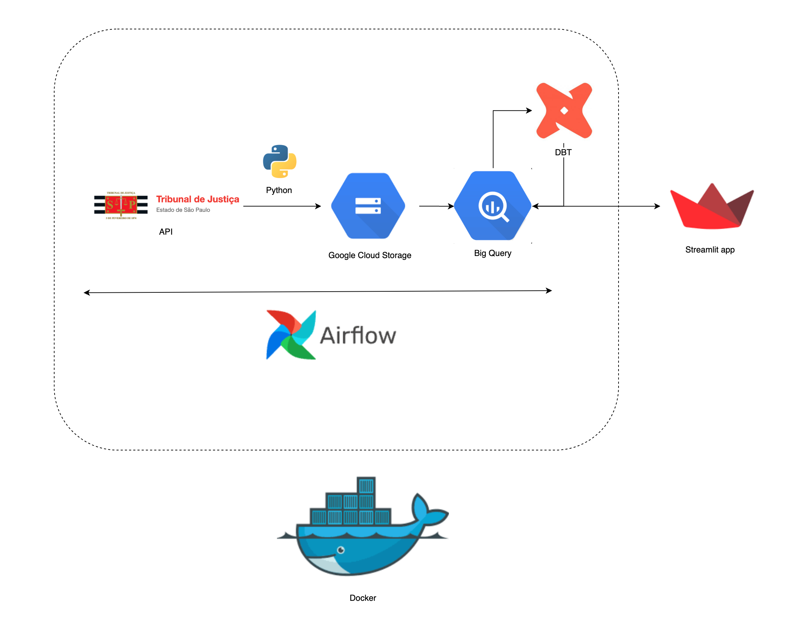

# Data Engineering Pipeline for Lawyers and Stakeholders of Justice in the State of São Paulo

Welcome to the **Data Engineering Pipeline** project, a robust solution for automating the extraction, transformation, and analysis of judicial suspension dates.

## Overview

This project features a fully automated pipeline designed to manage the lifecycle of judicial data:

1. **Data Extraction:**
    - Python scripts are used to query the São Paulo Court API and retrieve judicial data.
    - The data is stored in Parquet format in **Google Cloud Storage (GCS)** for efficient storage and access.

2. **Data Ingestion:**
    - Data is automatically ingested from GCS into **BigQuery** using an external table, enabling powerful querying and analysis capabilities.

3. **Data Transformation:**
    - The data undergoes transformation with **DBT (Data Build Tool)** to ensure only the most recent and relevant records are retained.
    - Additionally, DBT performs validation checks to eliminate duplicate values.

4. **Orchestration:**
    - The entire pipeline is orchestrated using **Apache Airflow**, ensuring reliable scheduling and management of tasks.
    - The solution is containerized with **Docker** for consistent and scalable deployment.

5. **Frontend Interface:**
    - A **Streamlit** frontend provides an interactive interface for data visualization.
    - It calculates deadlines for legal processes, accounting for holidays and suspensions specific to each São Paulo district.

## Requirements

- **Python 3.x**
- **Docker & Docker Compose**
- **Google Cloud Platform (GCP) account**
- **Apache Airflow**
- **DBT**
- **Streamlit**

## Project Diagram

Below is the diagram illustrating the architecture of the project:

